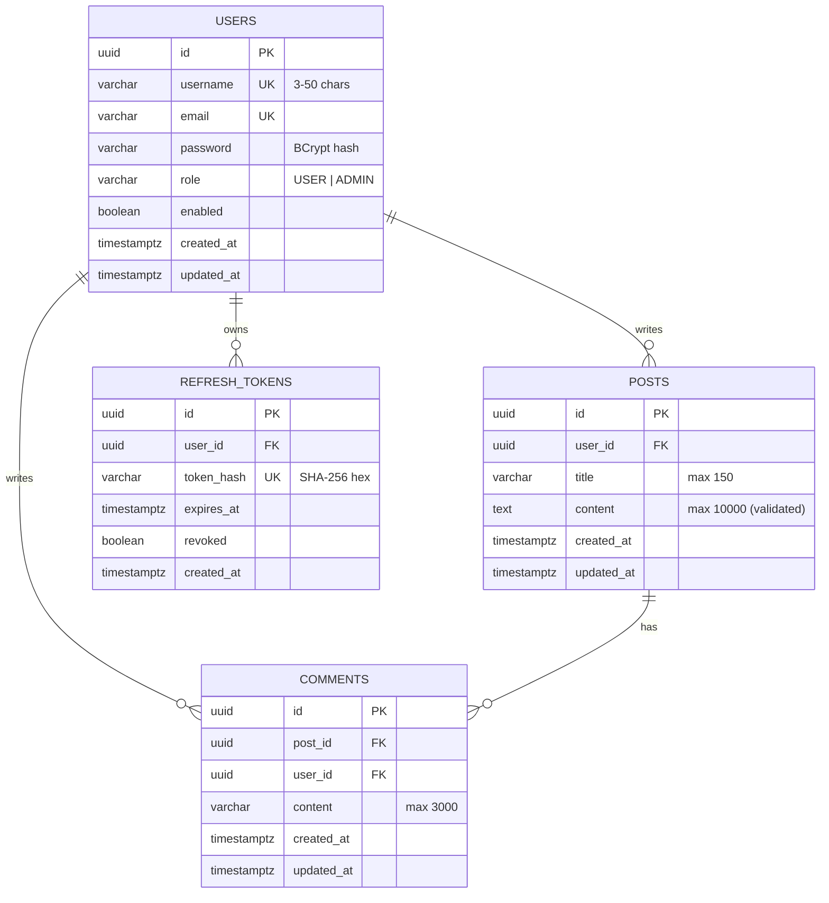

# Post API

A RESTful backend for a social feed — **Users → Posts → Comments** — built with Spring Boot 4, Spring Security (stateless JWT), Spring Data JPA, PostgreSQL and Liquibase.

It ships with access/refresh-token authentication with refresh-token rotation, role-based authorization (`USER` / `ADMIN`), ownership-based write protection, per-IP rate limiting, uniform JSON response envelopes, centralized error handling, interactive Swagger UI, and a fully containerized setup via Docker Compose.


> 📘 **Full endpoint reference:** see [`API.md`](./API.md).

---

## Table of Contents

- [Features](#features)
- [Tech Stack](#tech-stack)
- [Architecture](#architecture)
- [Data Model](#data-model)
- [Getting Started](#getting-started)
  - [Prerequisites](#prerequisites)
  - [Option A — Docker Compose (recommended)](#option-a--docker-compose-recommended)
  - [Option B — Run locally with Gradle](#option-b--run-locally-with-gradle)
- [Configuration](#configuration)
- [Authentication & Authorization](#authentication--authorization)
- [Rate Limiting](#rate-limiting)
- [Error Handling](#error-handling)
- [API Overview](#api-overview)
- [Interactive Documentation (Swagger UI)](#interactive-documentation-swagger-ui)
- [Database Migrations](#database-migrations)
- [Testing](#testing)
- [Project Structure](#project-structure)
- [Operational Notes & Known Limitations](#operational-notes--known-limitations)
- [Contributing](#contributing)
- [License](#license)

---

## Features

- **User accounts** — registration, login, profile retrieval/update, self-service account deletion.
- **Posts** — create, list (public, paginated), read, update, delete; list posts by author.
- **Comments** — create, list (paginated per post), update, delete.
- **JWT authentication** — short-lived access tokens (default 15 min) plus long-lived, **rotating** refresh tokens (default 7 days).
- **Refresh tokens stored hashed** — only SHA-256 hashes are persisted; raw tokens are never stored.
- **Authorization** — `ADMIN` role for moderation endpoints; owner-only edits/deletes for posts and comments.
- **Rate limiting** — token-bucket limiter (Bucket4j) per client IP, with a stricter bucket for auth endpoints.
- **Validation** — Jakarta Bean Validation on all request bodies with field-level error reporting.
- **Consistent responses** — every response (success or error) uses the same `ApiResponse` envelope.
- **Pagination & sorting** — Spring Data `page`, `size`, `sort` query parameters on every list endpoint.
- **Schema versioning** — Liquibase migrations; Hibernate runs in `validate` mode only.
- **OpenAPI / Swagger UI** — generated automatically with Bearer-auth support.
- **Containerized** — multi-stage Dockerfile (JDK build → JRE runtime, non-root user) and Compose stack with a PostgreSQL health check.

## Tech Stack

| Area | Technology |
| --- | --- |
| Language / Runtime | Java 21 |
| Framework | Spring Boot 4.0.6 (`spring-boot-starter-webmvc`) |
| Security | Spring Security, JJWT 0.13.0 (HS256) |
| Persistence | Spring Data JPA / Hibernate, PostgreSQL 16 |
| Migrations | Liquibase (YAML changelogs) |
| Validation | Jakarta Validation (`spring-boot-starter-validation`) |
| Mapping / Boilerplate | MapStruct 1.6.3, Lombok |
| Rate limiting | Bucket4j 8.14.0 (`bucket4j_jdk17-core`) |
| API docs | springdoc-openapi 2.8.5 (Swagger UI) |
| Build | Gradle 9.7.1 (wrapper included) |
| Testing | JUnit 5, Mockito, Spring Security Test, Testcontainers (PostgreSQL) |
| Containers | Docker, Docker Compose |

## Architecture

The codebase is **package-by-feature**, with each feature following a consistent layered layout:

```
controller  →  service (interface + impl)  →  repository  →  entity
        ↘ dto (records)        ↘ mapper (MapStruct)
```

| Package (`com.postapi.…`) | Responsibility |
| --- | --- |
| `auth` | Register, login, refresh, logout; refresh-token entity & repository |
| `user` | Profile read/update/delete; `User` entity and `UserRole` enum |
| `post` | Post CRUD, ownership checks, per-author listing |
| `comment` | Comment CRUD nested under posts |
| `admin` | Moderation: list users, delete any post/comment |
| `common.security` | `SecurityConfig`, JWT service & filter, `UserPrincipal`, error handlers for 401/403 |
| `common.ratelimit` | Bucket4j-based `RateLimitFilter` and its properties |
| `common.exception` | Domain exceptions and `GlobalExceptionHandler` |
| `common.dto` | `ApiResponse<T>` and `PageResponse<T>` envelopes |
| `common.base` | `BaseEntity` (UUID id, `createdAt`, `updatedAt`) |
| `common.swagger` | OpenAPI configuration |

**Request lifecycle**

```
Client ─▶ RateLimitFilter ─▶ JwtAuthenticationFilter ─▶ Spring Security authorization
       ─▶ Controller (+ @Valid) ─▶ Service (@Transactional) ─▶ Repository ─▶ PostgreSQL
       ◀─ ApiResponse<T> JSON  ◀── GlobalExceptionHandler on failure
```

## Data Model



All foreign keys use `ON DELETE CASCADE`: deleting a user removes their posts, comments and refresh tokens; deleting a post removes its comments.

---

## Getting Started

### Prerequisites

| Tool | Version | Needed for |
| --- | --- | --- |
| Docker + Docker Compose v2 | recent | Option A, and integration tests |
| JDK | 21 | Option B |
| Git | any | cloning |

Gradle does **not** need to be installed — use the bundled wrapper (`./gradlew`, or `gradlew.bat` on Windows).

### Option A — Docker Compose (recommended)

Runs PostgreSQL and the API together.

```bash
# 1. Clone and enter the project directory (the one containing docker-compose.yml)
git clone https://github.com/elsen111/user-post-api.git
cd user-post-api/post-api

# 2. Create your environment file
cp .env.example .env

# 3. Edit .env — at minimum set strong values for:
#      POSTGRES_PASSWORD
#      JWT_SECRET   (see note below)

# 4. Build and start
docker compose up --build -d

# 5. Follow the logs until you see the application has started
docker compose logs -f app
```

The API is now available at **http://localhost:8080** (or whatever `SERVER_PORT` you set), and Swagger UI at **http://localhost:8080/swagger-ui.html**.

Common commands:

```bash
docker compose ps            # service status
docker compose down          # stop (keeps the database volume)
docker compose down -v       # stop and DELETE the database volume
docker compose up --build -d # rebuild after code changes
```

> **Generating a `JWT_SECRET`**
> The secret must be at least **32 bytes** (HS256 requirement) and is required — there is no default.
> ```bash
> openssl rand -base64 48
> ```
> The value is used **as-is** (its UTF-8 bytes become the HMAC key); it is *not* Base64-decoded by the application, even though the comment in `.env.example` says "Base64-encoded". Any random string of 32+ characters works. Keep it private and never commit it.

### Option B — Run locally with Gradle

Run only the database in Docker, and the app on your machine.

```bash
cd post-api
cp .env.example .env          # set POSTGRES_PASSWORD and JWT_SECRET
docker compose up -d postgres # starts PostgreSQL 16 on localhost:5432
```

Spring Boot does not read `.env` automatically, so export the variables for your shell session. **Make sure the database name in the JDBC URL matches `POSTGRES_DB`** (the sample `.env` uses `post_api`, while the application's built-in default is `blog_api`):

```bash
export SPRING_DATASOURCE_URL=jdbc:postgresql://localhost:5432/post_api
export SPRING_DATASOURCE_USERNAME=postgres
export SPRING_DATASOURCE_PASSWORD=<your POSTGRES_PASSWORD>
export JWT_SECRET=<your 32+ byte secret>

./gradlew bootRun
```

Windows PowerShell:

```powershell
$env:SPRING_DATASOURCE_URL="jdbc:postgresql://localhost:5432/post_api"
$env:SPRING_DATASOURCE_USERNAME="postgres"
$env:SPRING_DATASOURCE_PASSWORD="<your POSTGRES_PASSWORD>"
$env:JWT_SECRET="<your 32+ byte secret>"
.\gradlew.bat bootRun
```

Build an executable JAR:

```bash
./gradlew bootJar
java -jar build/libs/*.jar
```

### Quick smoke test

```bash
# Register
curl -s -X POST http://localhost:8080/api/v1/auth/register \
  -H "Content-Type: application/json" \
  -d '{"username":"alice","email":"alice@example.com","password":"S3cretPass!"}'

# Copy the accessToken from the response, then create a post
curl -s -X POST http://localhost:8080/api/v1/posts \
  -H "Authorization: Bearer <accessToken>" \
  -H "Content-Type: application/json" \
  -d '{"title":"Hello","content":"My first post"}'

# Public feed (no token required)
curl -s "http://localhost:8080/api/v1/posts?page=0&size=10&sort=createdAt,desc"
```

### Creating an administrator

There is intentionally no public endpoint to grant the `ADMIN` role. Register a normal user, then promote it directly in the database:

```bash
docker compose exec postgres \
  psql -U "$POSTGRES_USER" -d "$POSTGRES_DB" \
  -c "UPDATE users SET role = 'ADMIN' WHERE email = 'alice@example.com';"
```

The role is re-read from the database on every authenticated request, so the promotion takes effect immediately.

---

## Configuration

All settings are driven by environment variables (see `src/main/resources/application.yaml` and `.env.example`).

| Variable | Default | Description |
| --- | --- | --- |
| `APP_NAME` | `blog-api` | Spring application name |
| `SERVER_PORT` | `8080` | HTTP port (in Compose, the *host* port mapped to container `8080`) |
| `SPRING_DATASOURCE_URL` | `jdbc:postgresql://localhost:5432/blog_api` | JDBC URL |
| `SPRING_DATASOURCE_USERNAME` | `postgres` | DB user |
| `SPRING_DATASOURCE_PASSWORD` | `postgres` | DB password |
| `JWT_SECRET` | **required** | HMAC signing secret, ≥ 32 bytes |
| `JWT_ACCESS_TOKEN_EXPIRATION` | `900000` | Access-token lifetime in **ms** (15 min) |
| `JWT_REFRESH_TOKEN_EXPIRATION` | `604800000` | Refresh-token lifetime in **ms** (7 days) |
| `RATE_LIMIT_ENABLED` | `true` | Master switch for rate limiting |
| `RATE_LIMIT_CAPACITY` | `100` | General API bucket size |
| `RATE_LIMIT_REFILL_TOKENS` | `100` | Tokens added per refill period (general) |
| `RATE_LIMIT_REFILL_DURATION_SECONDS` | `60` | Refill period in seconds (general) |
| `AUTH_RATE_LIMIT_CAPACITY` | `10` | Auth-endpoint bucket size |
| `AUTH_RATE_LIMIT_REFILL_TOKENS` | `10` | Tokens added per refill period (auth) |
| `AUTH_RATE_LIMIT_REFILL_DURATION_SECONDS` | `60` | Refill period in seconds (auth) |

Docker Compose additionally uses `POSTGRES_DB`, `POSTGRES_USER`, `POSTGRES_PASSWORD` and `POSTGRES_PORT` (default `5432`) to configure and expose the database container. The Compose `app` service builds its own JDBC URL (`jdbc:postgresql://postgres:5432/${POSTGRES_DB}`), so the `SPRING_DATASOURCE_*` values in `.env` are only used for local (non-Docker) runs.

Notable fixed settings: `spring.jpa.open-in-view=false`, `spring.jpa.hibernate.ddl-auto=validate`, Swagger UI at `/swagger-ui.html`, OpenAPI JSON at `/v3/api-docs`.

---

## Authentication & Authorization

### Token model

| Token | Format | Default lifetime | Stored server-side? |
| --- | --- | --- | --- |
| **Access token** | JWT (HS256) with `sub` = email, `userId`, `role` claims | 15 minutes | No (stateless) |
| **Refresh token** | Opaque random string | 7 days | Yes — **SHA-256 hash only**, with `expires_at` and `revoked` |

Send the access token on protected requests:

```
Authorization: Bearer <accessToken>
```

### Flow

1. `POST /api/v1/auth/register` or `/login` → returns `accessToken` + `refreshToken`.
2. Call protected endpoints with the access token.
3. When it expires (HTTP `401`), call `POST /api/v1/auth/refresh` with the refresh token. The old refresh token is **revoked** and a **new pair** is issued (rotation). Re-using a revoked token is rejected.
4. `POST /api/v1/auth/logout` revokes the supplied refresh token.

### Access rules

| Rule | Applies to |
| --- | --- |
| **Public** (no token) | `POST /auth/register`, `/auth/login`, `/auth/refresh`; `GET /posts`; Swagger UI & OpenAPI docs |
| **Authenticated** | Everything else (including `GET /posts/{id}`, comment reads, and `POST /auth/logout`) |
| **Owner only** | `PATCH`/`DELETE` on a post or comment — returns `403` for non-owners |
| **`ADMIN` only** | Everything under `/api/v1/admin/**` |

Passwords are hashed with a Spring `PasswordEncoder` bean; emails are trimmed and lower-cased on registration, login and update, and username/email uniqueness is checked case-insensitively.

---

## Rate Limiting

A servlet filter applies a **token bucket per client IP** to all `/api/**` requests:

| Bucket | Paths | Default |
| --- | --- | --- |
| **Auth** | `/api/v1/auth/login`, `/register`, `/refresh` | 10 requests / 60 s |
| **General** | all other `/api/**` (including `/auth/logout`) | 100 requests / 60 s |

When exhausted, the API responds `429 Too Many Requests`:

```json
{
  "success": false,
  "message": "Too many requests. Please try again later.",
  "data": null,
  "timestamp": "2026-10-08T12:00:00.000Z"
}
```

Buckets are held **in memory, per application instance** and keyed by `request.getRemoteAddr()`. See [Operational Notes](#operational-notes--known-limitations) for what that means behind a reverse proxy or when scaling horizontally.

---

## Error Handling

Every error uses the standard envelope — clients can rely on `success: false` and a human-readable `message`.

```json
{
  "success": false,
  "message": "Validation failed",
  "data": {
    "fields": {
      "title": "Title is required",
      "content": "Content must not exceed 10000 characters"
    }
  },
  "timestamp": "2026-10-08T12:00:00.000Z"
}
```

| Status | When |
| --- | --- |
| `400` | Bean-validation failure, malformed JSON, invalid path/query parameter (e.g. non-UUID id) |
| `401` | Missing/invalid/expired access token; bad credentials; invalid/expired/revoked refresh token |
| `403` | Not the owner; not an admin; disabled account |
| `404` | Post, comment or user not found |
| `409` | Username/email already in use; database constraint violation |
| `429` | Rate limit exceeded |
| `500` | Unexpected error (details are logged server-side, not leaked to the client) |

The full per-endpoint matrix is in [`API.md`](./API.md#error-reference).

---

## API Overview

Base path: `/api/v1`. Full request/response documentation lives in [`API.md`](./API.md).

| Method | Endpoint | Auth | Description |
| --- | --- | --- | --- |
| `POST` | `/auth/register` | Public | Create an account |
| `POST` | `/auth/login` | Public | Obtain access + refresh tokens |
| `POST` | `/auth/refresh` | Public | Rotate refresh token, get new pair |
| `POST` | `/auth/logout` | Bearer | Revoke a refresh token |
| `GET` | `/users/me` | Bearer | Current user profile |
| `PATCH` | `/users/me` | Bearer | Update own username/email |
| `DELETE` | `/users/me` | Bearer | Delete own account |
| `GET` | `/users/{userId}/posts` | Bearer | Posts by a user (paginated) |
| `POST` | `/posts` | Bearer | Create a post |
| `GET` | `/posts` | Public | Global feed (paginated) |
| `GET` | `/posts/{postId}` | Bearer | Get one post |
| `GET` | `/posts/user/{userId}` | Bearer | Posts by a user (paginated) |
| `PATCH` | `/posts/{postId}` | Bearer (owner) | Update a post |
| `DELETE` | `/posts/{postId}` | Bearer (owner) | Delete a post |
| `POST` | `/posts/{postId}/comments` | Bearer | Add a comment |
| `GET` | `/posts/{postId}/comments` | Bearer | List comments (paginated) |
| `PATCH` | `/comments/{commentId}` | Bearer (owner) | Update a comment |
| `DELETE` | `/comments/{commentId}` | Bearer (owner) | Delete a comment |
| `GET` | `/admin/users` | Bearer (ADMIN) | List all users (paginated) |
| `DELETE` | `/admin/posts/{postId}` | Bearer (ADMIN) | Delete any post |
| `DELETE` | `/admin/comments/{commentId}` | Bearer (ADMIN) | Delete any comment |

**Pagination** — all list endpoints accept `?page=0&size=20&sort=createdAt,desc` and return a `PageResponse` (`content`, `page`, `size`, `totalElements`, `totalPages`, `first`, `last`). Pages are zero-indexed.

## Interactive Documentation (Swagger UI)

| Resource | URL |
| --- | --- |
| Swagger UI | `http://localhost:8080/swagger-ui.html` |
| OpenAPI JSON | `http://localhost:8080/v3/api-docs` |

Click **Authorize** in Swagger UI and paste your access token (without the `Bearer ` prefix) to try protected endpoints.

---

## Database Migrations

Schema changes are managed exclusively by Liquibase; Hibernate only **validates** the schema at startup (`ddl-auto: validate`), so a mismatch between entities and migrations fails fast.

```
src/main/resources/db/
├── changelog-master.yaml
└── changelog/
    ├── 001__create_users_table.yaml
    ├── 002__create_posts_table.yaml
    ├── 003__create_comments_table.yaml
    └── 004__create_refresh_tokens_table.yaml
```

Migrations run automatically on startup. To change the schema, **add a new numbered changelog** and include it in `changelog-master.yaml` — never edit a changelog that has already been applied.

> Primary keys use `gen_random_uuid()` (built into PostgreSQL 13+).

## Testing

```bash
./gradlew test
```

| Suite | Type | Notes |
| --- | --- | --- |
| `AuthServiceTest`, `UserServiceTest`, `PostServiceTest`, `CommentServiceTest` | Unit (Mockito) | Service-layer logic |
| `AdminControllerSecurityTest` | MockMvc + Spring Security Test | Verifies `401` / `403` / `200` access rules for admin endpoints |
| `PostApiIntegrationTest` | Integration (Testcontainers) | Boots a real PostgreSQL 16 container and asserts Liquibase creates all four tables |

Requirements for running the full suite:

- **Docker must be running** (Testcontainers starts PostgreSQL).
- Tests run with the `test` Spring profile, and the repository does not include an `application-test` file. Since `JWT_SECRET` has no default, **export `JWT_SECRET`** (32+ bytes) in your environment before running tests, or add a `src/test/resources/application-test.yaml` that supplies one.

The Docker image build skips tests (`-x test`), so run them in CI/locally before building images.

## Project Structure

```
user-post-api/
├── README.md
├── API.md
└── post-api/
    ├── build.gradle
    ├── settings.gradle
    ├── Dockerfile
    ├── docker-compose.yml
    ├── .env.example
    ├── gradlew / gradlew.bat
    └── src/
        ├── main/
        │   ├── java/com/postapi/
        │   │   ├── PostApiApplication.java
        │   │   ├── admin/       (controller, service)
        │   │   ├── auth/        (controller, dto, entity, repository, service)
        │   │   ├── comment/     (controller, dto, entity, mapper, repository, service)
        │   │   ├── post/        (controller, dto, entity, mapper, repository, service)
        │   │   ├── user/        (controller, dto, entity, mapper, repository, service)
        │   │   └── common/      (base, dto, exception, ratelimit, security, swagger)
        │   └── resources/
        │       ├── application.yaml
        │       └── db/ (Liquibase changelogs)
        └── test/java/com/postapi/ (unit, security & integration tests)
```

---

## Operational Notes & Known Limitations

Being upfront about current behavior helps you deploy and extend the service safely.

**Security & deployment**

- **Always set your own `JWT_SECRET` and DB password.** Never commit `.env` (it is git-ignored; only `.env.example` is tracked).
- **Terminate TLS in front of the API** (reverse proxy / load balancer). The app itself speaks plain HTTP.
- **Rate limiting uses the socket address.** Behind a reverse proxy every client may appear as the proxy's IP, collapsing all users into one bucket. Configure the proxy/servlet container to forward the real client IP (e.g. Spring's `server.forward-headers-strategy`) before relying on it in production.
- **Rate-limit state is in-memory.** It resets on restart, isn't shared between replicas, and buckets are not evicted over time. For multi-instance deployments, move the limiter to a shared store (e.g. Bucket4j + Redis).
- **Access tokens are stateless.** Logout revokes the *refresh* token only; an issued access token stays valid until it expires (default 15 min).
- **Changing your email invalidates your current access token**, because the token's subject is the email. Obtain a new one via `/auth/login` or `/auth/refresh`.
- **Disabled accounts** (`enabled = false`) are rejected at login, but the JWT filter does not re-check the flag for already-issued access tokens. No endpoint currently toggles `enabled`.
- Refresh tokens are never purged; expired/revoked rows accumulate in `refresh_tokens`.

**API behavior worth knowing**

- `PATCH` endpoints (`/posts/{id}`, `/comments/{id}`, `/users/me`) currently require **all** fields of their body (they behave like full updates).
- `GET /posts/user/{userId}` and `GET /users/{userId}/posts` return the same data and do **not** return `404` for an unknown user — they return an empty page.
- `GET /posts` is public, but `GET /posts/{id}` and comment listings require authentication.
- Deleting a user, post or comment is a **hard delete** and cascades.
- Routing-level errors (unknown URL, unsupported HTTP method, unsupported media type) are not mapped individually; the catch-all handler may report them as `500`. Treat any such response as a client routing/content-type mistake.

**Housekeeping**

- The OpenAPI title/description in `OpenApiConfig` are placeholder text ("My Feature-Layered API … orders, users, and more").
- `.env.example` documents `JWT_SECRET` as Base64-encoded, but the code uses the raw string bytes.
- `.env.example` uses `post_api` for `POSTGRES_DB` but `blog_api` in `SPRING_DATASOURCE_URL`; keep them consistent when running locally.
